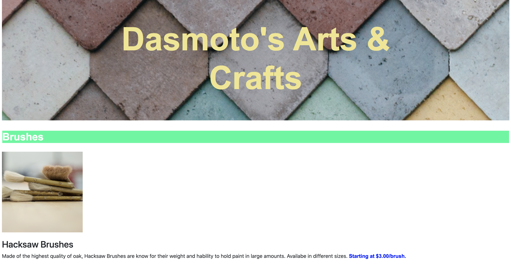
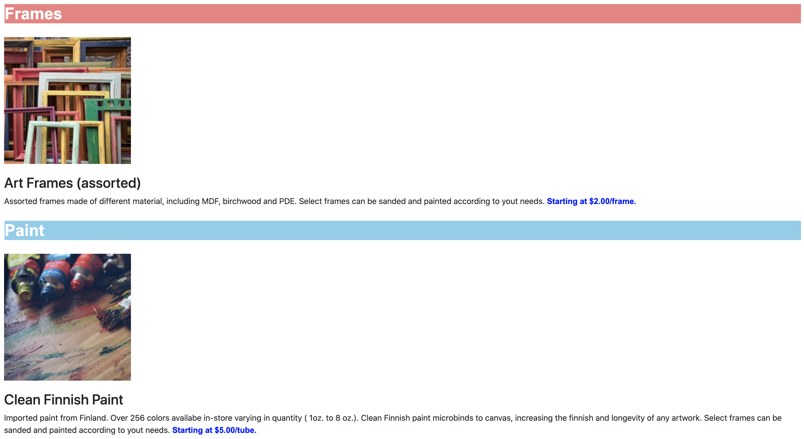

## Details

I'm learning how to code, and dasmoto-exercise is a project by [codeacademy](https://www.codecademy.com/).

#### Languages
 * HTML
 * JavaScript

 #### CSS framework
 * Bootstrap 4.5

#### Images

